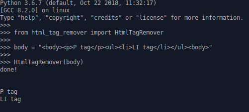

# HtmlTagRemover
a python class for remove html tags from string

### how to use
first import the class where ever you want, then:
```
from html_tag_remover import HtmlTagRemover

body = "<body><p>P tag</p><ul><li>LI tag</li></ul></body>"
HtmlTagRemover(body)
```
and the result is :



### PS:
`<li>` tags each export in new line
`` tags exported as `//link//`, ofcourse you can change it
`<a>` just text of this tags will export

have fun :)
